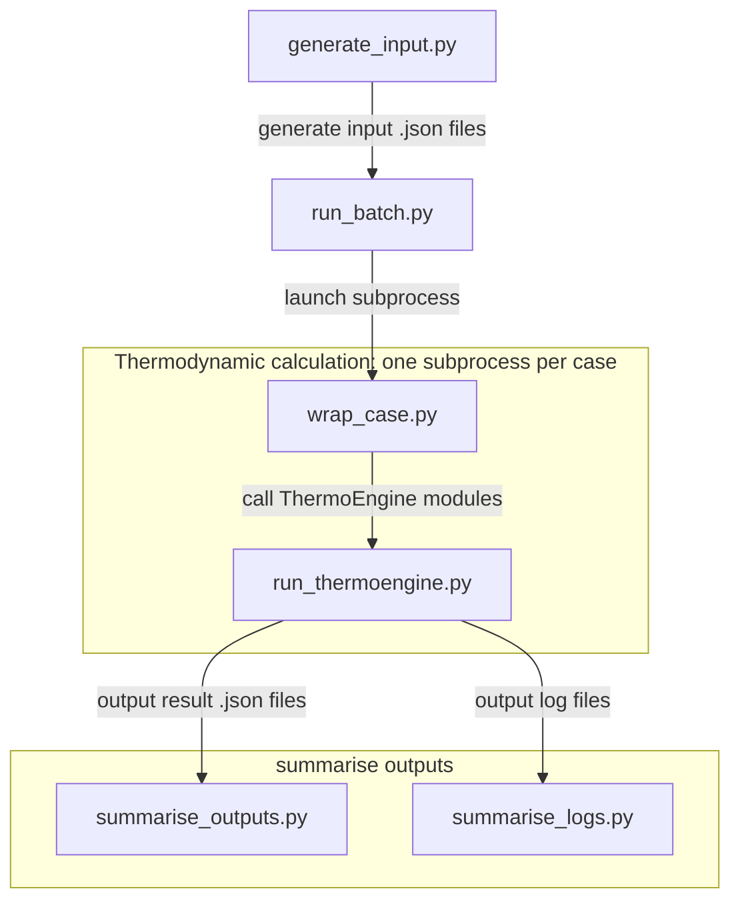

# thermoengine-pipeline
A wrapper for running phase-equilibrium calculations with ThermoEngine.

## Overview
This repository is under development and may contain unexpectd bugs.

## Requirements
This repository has been developed under following enviornments:
- Ubuntu 24.04 LTS on WSL2 (Windows 11 Pro 25H2)
- Docker Desktop
- [ThermoEngine](https://gitlab.com/ENKI-portal/ThermoEngine)

## Usage
- Generate input json files
- Run batch calculations
- Aggregate calculation output json files and log files

